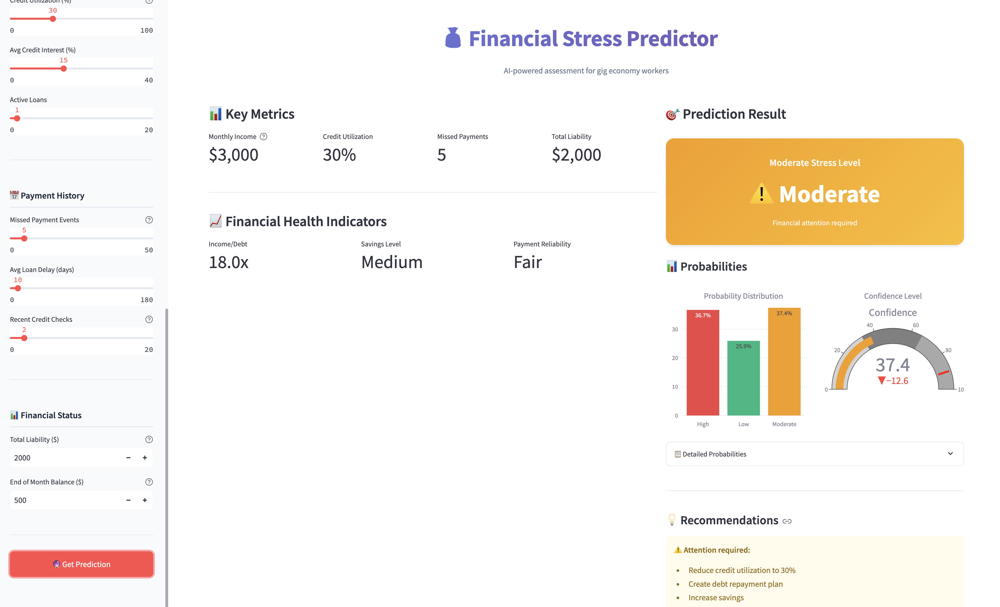

# Financial Stress Prediction API

ML service for predicting financial stress levels of gig economy workers based on financial and behavioral data.

## Overview

REST API for classifying financial stress levels (Low, Moderate, High) using a Random Forest model.



**Model Performance:**
- Accuracy: ~77%
- F1-score (weighted): ~77%

## Quick Start

### 1. Train Model

```bash
cd scripts
python3 train_model.py
```

This creates `models/model_artifacts.joblib` with all necessary components.

### 2. Run API Server

```bash
# Install dependencies
pip install -r requirements.txt

# Start server
uvicorn app.main:app --host 0.0.0.0 --port 8000 --reload
```

API available at: http://localhost:8000  
Swagger UI: http://localhost:8000/docs

### 3. Run Streamlit UI

```bash
streamlit run app_ui.py
```

Or use the convenience script:
```bash
./run_local.sh
```

## API Endpoints

### Health Check
**GET** `/health`

```bash
curl http://localhost:8000/health
```

### Model Info
**GET** `/`

```bash
curl http://localhost:8000/
```

### Single Prediction
**POST** `/predict`

```bash
curl -X POST http://localhost:8000/predict \
  -H "Content-Type: application/json" \
  -d '{
    "features": {
      "worker_age": 28.0,
      "job_sector": "Writer",
      "monthly_gig_income": 3000.0,
      "num_credit_cards": 2,
      "credit_utilization_rate": 30.0,
      "missed_payment_events": 5,
      "current_total_liability": 2000.0
    }
  }'
```

**Response:**
```json
{
  "predicted_stress_level": "Moderate",
  "prediction_probabilities": {
    "High": 0.15,
    "Low": 0.25,
    "Moderate": 0.60
  }
}
```

### Batch Prediction
**POST** `/predict_batch`

Prediction for multiple workers (up to 1000 at once).

## Input Features

All fields are optional. Key features:

- `worker_age` - Worker age
- `job_sector` - Job type (Driver, Writer, Engineer, etc.)
- `monthly_gig_income` - Monthly gig income
- `num_credit_cards` - Number of credit cards
- `credit_utilization_rate` - Credit limit usage (%)
- `missed_payment_events` - Number of missed payments
- `current_total_liability` - Total debt
- `num_active_loans` - Number of active loans
- `avg_loan_delay_days` - Average loan payment delay (days)
- `end_of_month_balance` - End of month balance

See `app/models.py` for complete feature list.

## Project Structure

```
.
├── app/                     # Main application
│   ├── main.py              # FastAPI application
│   ├── models.py            # Pydantic validation models
│   ├── predictor.py         # Prediction class
│   └── preprocessing.py     # Preprocessing functions
├── models/                  # Trained models
│   └── model_artifacts.joblib
├── scripts/                 # Utility scripts
│   ├── train_model.py       # Model training
│   └── test_api.py          # API testing
├── app_ui.py                # Streamlit UI
├── requirements.txt         # Dependencies
└── Dockerfile               # Docker configuration
```

## Docker

```bash
# Build image
docker build -t financial-stress-api .

# Run container
docker run -p 8000:8000 financial-stress-api
```

## Model Details

- **Algorithm**: RandomForestClassifier
- **Parameters**: n_estimators=270, max_depth=35
- **Features**: 19 financial and behavioral characteristics
- **Classes**: Low, Moderate, High stress

## License

Project created for educational purposes.
